# Converging Paths - match data

Screenshots and their parsed data live together in this folder. One details-screen
screenshot per match, `match-NNN.png`, with the block of the same id below.

Compete and spectate matches are recorded TOGETHER on purpose. The claim under test is that
the details screen is identical in both modes; separating them by folder would hide the
evidence either way. Each block records its `mode` so the two can be compared later.

Blue is the LEFT player. On this screen that is the `Ally` panel in both modes observed so
far.

---

## match-001


```
id: 001
screenshot: match-001.png
mode: compete
date: 2026-07-26 09:45
theme: Converging Paths
blue_player: GameRetro
red_player: Sisif
blue_rating:
red_rating:
blue_rank:
red_rank:
blue_heroes: Solise, Valka, Kafra
red_heroes: Laios, Callan, Silven
winner: red
```

Per-hero stats read from the same screenshot. Columns are named for their ICONS, because the
shield column's meaning is still unconfirmed:

| side | hero | sword | heart | shield |
|---|---|---|---|---|
| blue | Solise | 0 | 1,960K | 4,187K |
| blue | Valka | 1,994K | 0 | 5,799K |
| blue | Kafra | 1,486K | 0 | 6,785K |
| red | Laios | 2,639K | 3,228K | 4,123K |
| red | Callan | 245K | 0 | 4,823K |
| red | Silven | 5,022K | 0 | 253K |

**Parse notes.** All six heroes identified by image match at 0.80-0.91 with margins
0.21-0.42, so this compete screenshot works with the cells measured on a SPECTATE frame -
first direct evidence for the identical-screen claim. The winner and all eighteen stat
numbers parsed automatically.

`blue_player` came back from OCR as `GAME`, not `GameRetro`: the account badge overlaps the
start of the name on this screen. Corrected by hand above. Worth knowing before player names
are used for anything that matters, such as the dedupe key.

Ratings and ranks are blank because the details screen does not show them - they are on the
pre-match screen. Leave them empty rather than guessing.

---

## Deadline

`Converging Paths` rotates on **2026-07-28** (event screen showed "Rotates in 2d 20h" on
2026-07-26). Matches are only comparable within a theme, so anything not collected under this
theme before the rotation cannot be recovered afterwards - it belongs to a different
generating process. Collection needs to be running before then.

---

## match-002


```
id: 002
screenshot: match-002.png
mode: spectate
date: 2026-07-26 10:05
theme: Converging Paths
winning_side: left
winning_player: leeler
winning_heroes: Cassadee, Reinier, Pippa
losing_player: Santa
losing_heroes: Granny Dahnie, Lily May, Cryonaia
```

| side | hero | sword | heart | shield |
|---|---|---|---|---|
| won | Cassadee | 1,761K | 0 | 3,759K |
| won | Reinier | 1,145K | 1,948K | 804K |
| won | Pippa | 4,121K | 0 | 591K |
| lost | Granny Dahnie | 0 | 449K | 8,246K |
| lost | Lily May | 1,123K | 0 | 3,168K |
| lost | Cryonaia | 2,205K | 0 | 2,978K |

**Parse notes.** All six heroes identified at 0.836-0.924.

This screenshot caught a real bug. It is the first frame where the LEFT side won, and the
parser reported the winner as the right side - inverted. Cause: OCR found no "Victory" or
"Defeat" text at all in the header band, only the player names, because those words are
faint watermark-style text. The two earlier frames both happened to have the right side
winning, so a wrong implementation passed them.

Fixed by reading the winner from which header half is tinted orange (the winning half) and
keeping OCR only as a fallback. Verified on all four frames with independently known
winners, two right-wins and one left-win: 4/4 correct, no side favoured.

---

## match-003


```
id: 003
screenshot: match-003.png
mode: spectate
date: 2026-07-26 23:10
theme: Converging Paths
winning_side: right
winning_player: Tamau
winning_heroes: Eironn, Baelran, Ludovic
losing_player: Oipiq
losing_heroes: Hugin, Galahad, Nazrik
```

| side | hero | sword | heart | shield |
|---|---|---|---|---|
| won | Eironn | 1,745K | 0 | 5,591K |
| won | Baelran | 2,735K | 1,771K | 3,333K |
| won | Ludovic | 783K | 7,221K | 0 |
| lost | Hugin | 65,774 | 0 | 2,562K |
| lost | Galahad | 2,119K | 0 | 2,509K |
| lost | Nazrik | 508K | 0 | 3,480K |

**Parse notes.** 6/6 at 0.802-0.910, winner and both player names correct.

This frame settled the letter-matching question. The idea was sound - "Victory" and "Defeat"
share only e and t, so partial text should disambiguate - but across four frames OCR never
recovered "Victory" at all, only "feat" and "Defea". Worse, the one word that does read is
the one a player name can imitate: names sit in the same band, a long name bleeds inward past
any inner-band crop, and real examples cut both ways. Here **Tamau** carries a Defeat letter
while on the WINNING side, and **Oipiq** carries Victory letters while on the LOSING side.

So the winner is read from colour alone, which was correct on all five frames checked in both
directions. A tie returns None rather than a guess.

---

## match-004

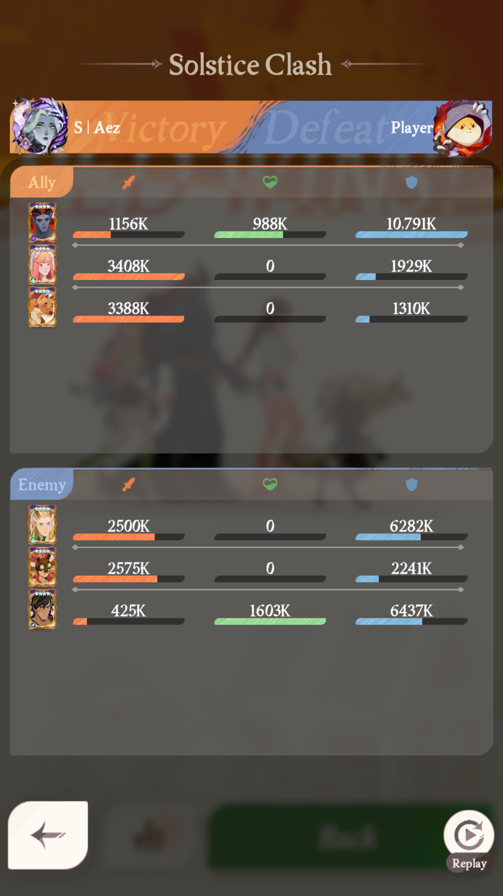

```
id: 004
screenshot: match-004.png
mode: spectate
date: 2026-07-26 23:40
theme: Converging Paths
winning_side: first three (top panel)
winning_player: S | Aez
winning_heroes: Phraesto, Lyca, Odie
losing_player: Player
losing_heroes: Eironn, Rhys, Perseus
```

| side | hero | sword | heart | shield |
|---|---|---|---|---|
| won | Phraesto | 1,156K | 988K | 10,791K |
| won | Lyca | 3,408K | 0 | 1,929K |
| won | Odie | 3,388K | 0 | 1,310K |
| lost | Eironn | 2,500K | 0 | 6,282K |
| lost | Rhys | 2,575K | 0 | 2,241K |
| lost | Perseus | 425K | 1,603K | 6,437K |

**Parse notes.** 6/6 at 0.884-0.913. Second independent case of the FIRST three winning, and
the winner was read correctly from the roster panel tint. Verified against the screenshot by
eye as well: Victory sits on the left and the top panel tab is orange.

Player names read as `S | Aez` and `Player`, which look like genuine display names rather
than OCR damage.

## Winner detection - current state

Three signals, tried in order:

1. **Roster panel tint** - orange on a tab means that panel's trio won. Primary. Ignores left
   and right entirely, which is all that matters here, and the tab is a solid fill with no
   name, avatar or watermark near it.
2. **Banner colour** - the winning half is orange. Probed in the top strip only, using the
   median, to dodge avatars, the watermark and long player names.
3. **OCR of Victory / Defeat** - last resort only. It returned the WRONG side on the first
   left-win frame we captured, because those words are faint watermarks that OCR frequently
   misses entirely.

The panel labels themselves are never read. In spectate `Ally` means whichever side you bet
on and flips between matches.

Correct on all six frames with known winners: four right-wins and two left-wins, across both
compete and spectate.

---

## match-005

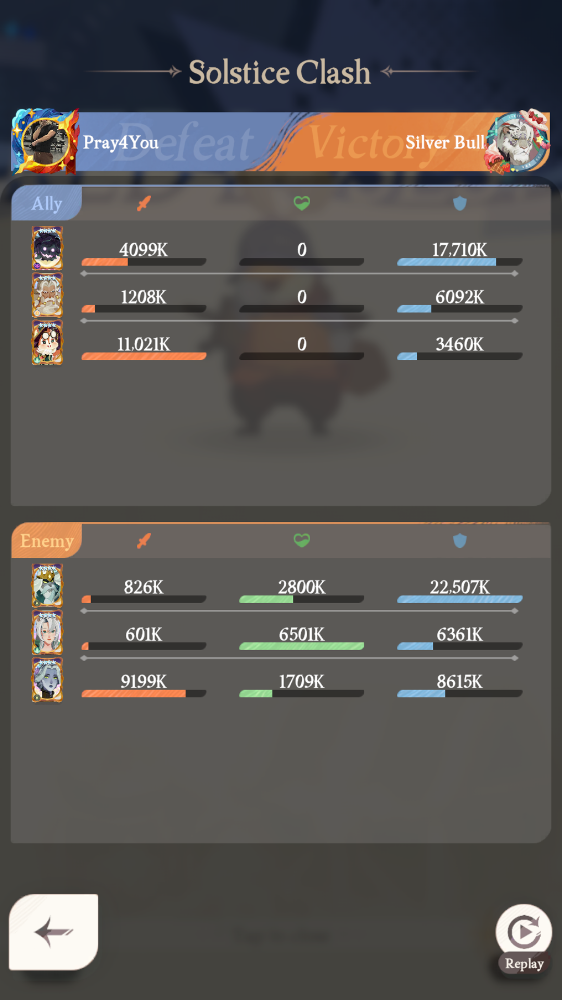

```
id: 005
screenshot: match-005.png
mode: spectate
date: 2026-07-26 23:55
theme: Converging Paths
winning_side: last three (bottom panel)
winning_player: Silver Bull
winning_heroes: Thoran, Solise, Zorya
losing_player: Pray4You
losing_heroes: Berial, Dunlingr, Pippa
```

| side | hero | sword | heart | shield |
|---|---|---|---|---|
| won | Thoran | 826K | 2,800K | 22,507K |
| won | Solise | 601K | 6,501K | 6,361K |
| won | Zorya | 9,199K | 1,709K | 8,615K |
| lost | Berial | 4,099K | 0 | 17,710K |
| lost | Dunlingr | 1,208K | 0 | 6,092K |
| lost | Pippa | 11,021K | 0 | 3,460K |

**Parse notes.** 6/6 at 0.794-0.920.

This frame settles the panel-order question. The bet was on the LEFT player, so `Ally` was
the top panel and the left side - and the left side LOST while its tab was blue. So:

- **first three = left player, last three = right player** - the invariant
- **orange tab = that trio won, blue tab = they lost** - independent of which is `Ally`
- `Ally` / `Enemy` track who you bet on and are irrelevant to the data

Running tally across all frames with known winners: 7 frames, 4 right-wins and 2 left-wins
plus this one, across compete and spectate, all read correctly.

---

## match-007

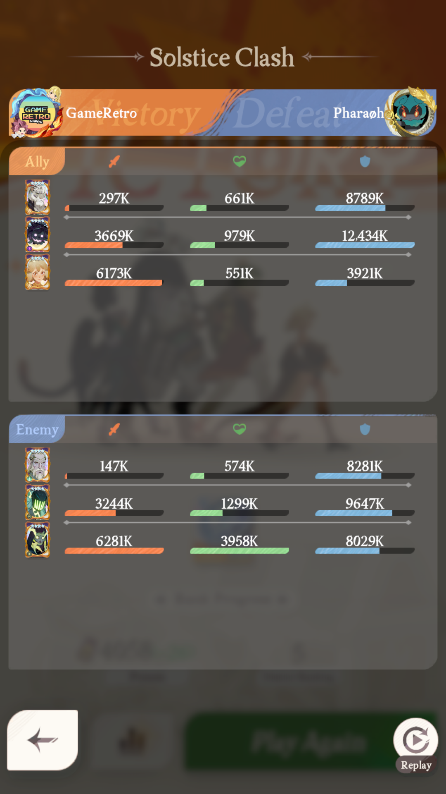

```
id: 007
screenshot: match-007.png
mode: spectate
theme: Converging Paths
winning_side: left
winning_player: GAME
winning_heroes: Kordan, Berial, Alsa
losing_player: Pharagh
losing_heroes: Thador, Igor, Viperian
```

---

## match-008

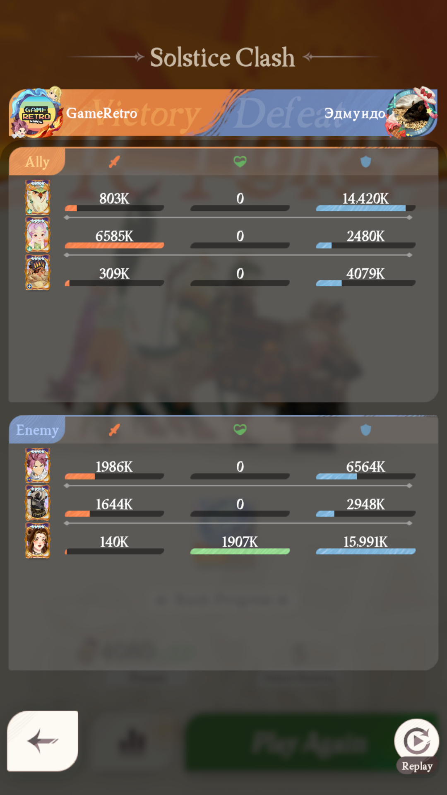

```
id: 008
screenshot: match-008.png
mode: spectate
theme: Converging Paths
winning_side: left
winning_player: GAME
winning_heroes: Kafra, Florabelle, Hugin
losing_player: None
losing_heroes: Natsu, Nazrik, Gerda
```

---

## match-009

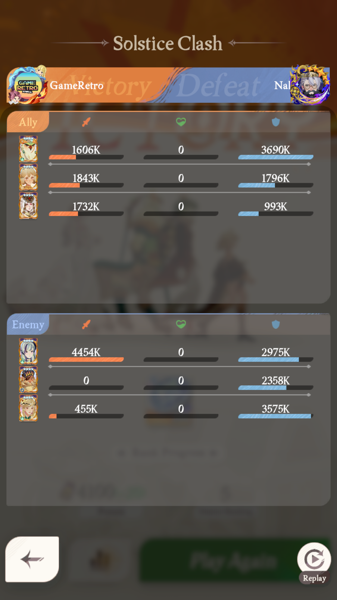

```
id: 009
screenshot: match-009.png
mode: spectate
theme: Converging Paths
winning_side: left
winning_player: GAME
winning_heroes: Kafra, Alsa, Galahad
losing_player: NalC
losing_heroes: Lily May, Hugin, Parisa
```

---

## match-010

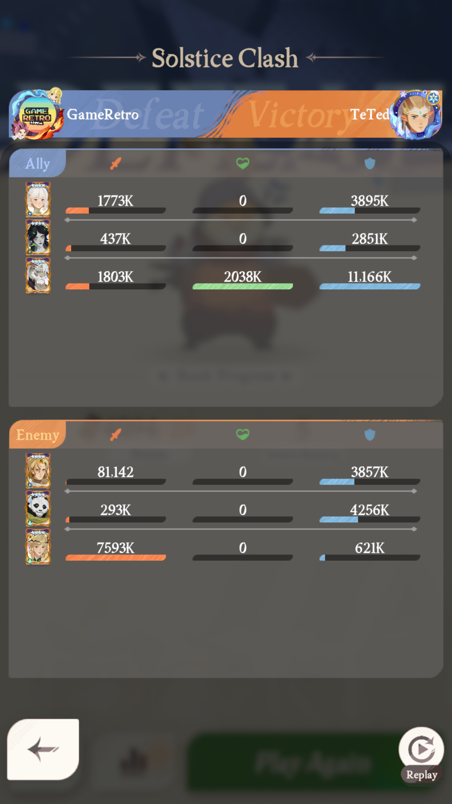

```
id: 010
screenshot: match-010.png
mode: spectate
theme: Converging Paths
winning_side: right
winning_player: TeTed
winning_heroes: Temesia, Pang, Parisa
losing_player: GAME
losing_heroes: Cassadee, Cecia, Kordan
```

---

## match-011

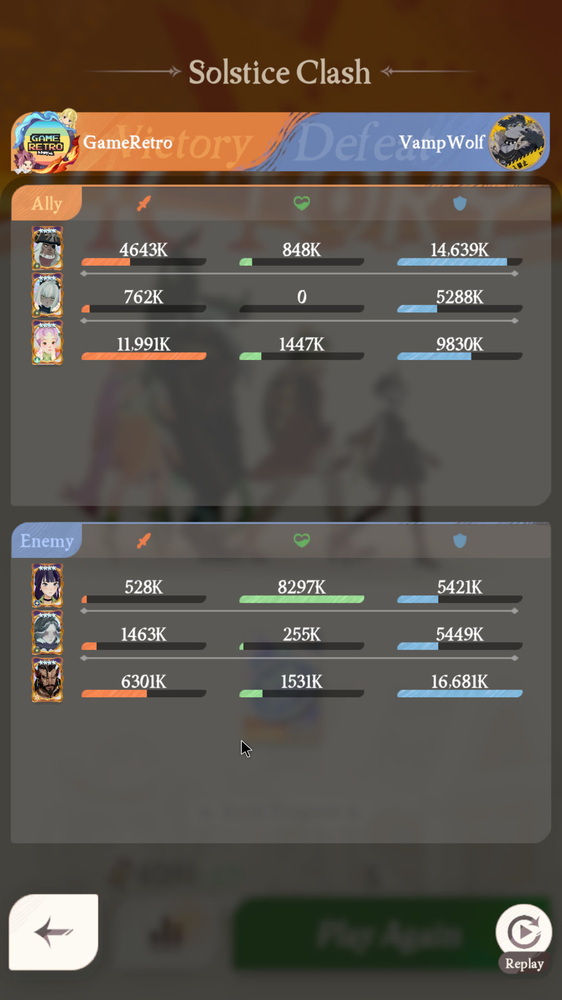

```
id: 011
screenshot: match-011.png
mode: spectate
theme: Converging Paths
winning_side: left
winning_player: GAME
winning_heroes: Hodgkin, Silvina, Florabelle
losing_player: VampWolf
losing_heroes: Evie, Carolina, Zandrok
```

---

## match-012

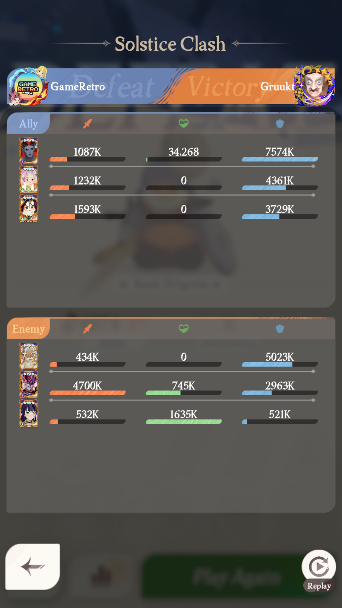

```
id: 012
screenshot: match-012.png
mode: spectate
theme: Converging Paths
winning_side: right
winning_player: None
winning_heroes: Dunlingr, Harak, Evie
losing_player: GAME
losing_heroes: Phraesto, Florabelle, Pippa
```

---

## match-013

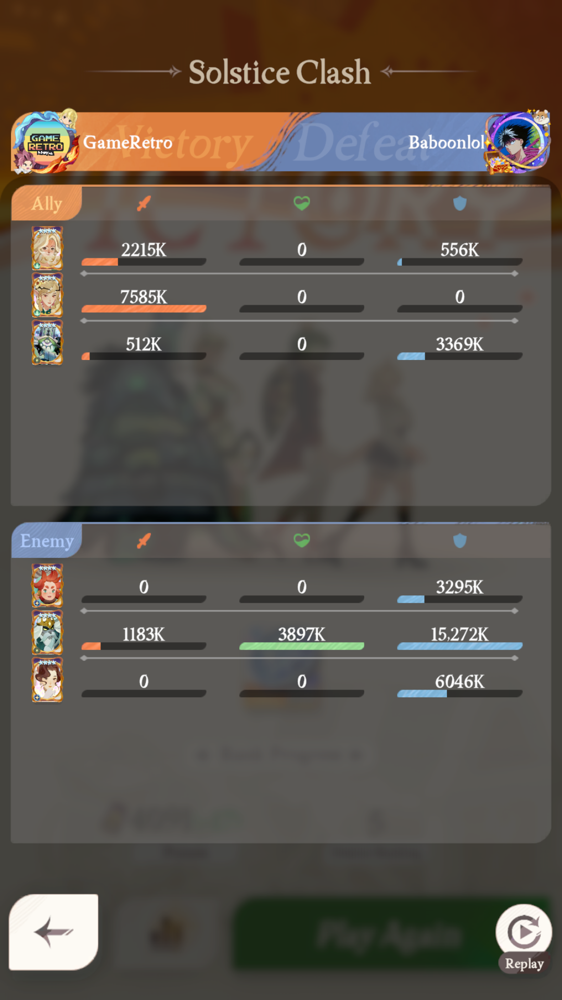

```
id: 013
screenshot: match-013.png
mode: spectate
theme: Converging Paths
winning_side: left
winning_player: GAME
winning_heroes: Lenya, Parisa, Callan
losing_player: Baboonlol
losing_heroes: Rowan, Thoran, Vala
```

---

## match-014

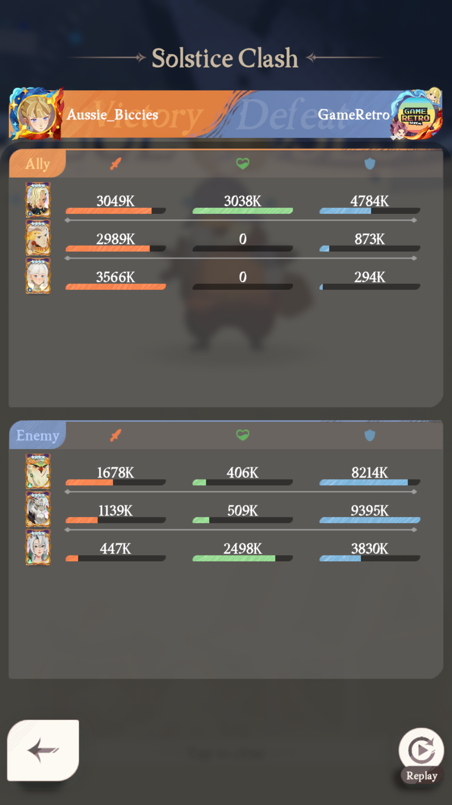

```
id: 014
screenshot: match-014.png
mode: spectate
theme: Converging Paths
winning_side: left
winning_player: Aussie
winning_heroes: Sonja, Dionel, Cassadee
losing_player: GameRetro
losing_heroes: Kafra, Kordan, Solise
```

---

## match-015

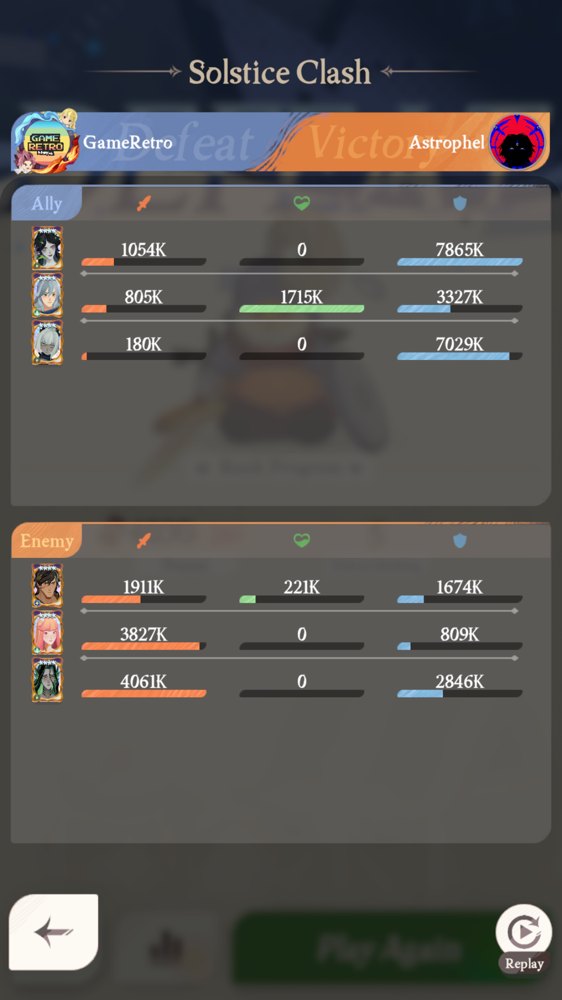

```
id: 015
screenshot: match-015.png
mode: spectate
theme: Converging Paths
winning_side: right
winning_player: Astrophel
winning_heroes: Perseus, Lyca, Nerion
losing_player: GAME
losing_heroes: Cecia, Lorsan, Silvina
```

---

## Batch note (007-015)

Nine matches captured while iterating on the mode. All 54 heroes identified by image match
at 0.81-0.95, none below the accept rule.

`winning_player` / `losing_player` read as `GAME` wherever the account badge overlaps the
name - that is the left slot when GameRetro is playing. It reads correctly when the same
account sits on the right (match-014: `Aussie` vs `GameRetro`). Names are not used for
anything load-bearing yet, so this is recorded rather than corrected.
