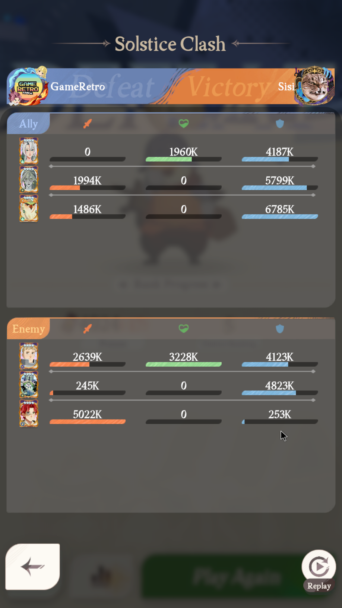
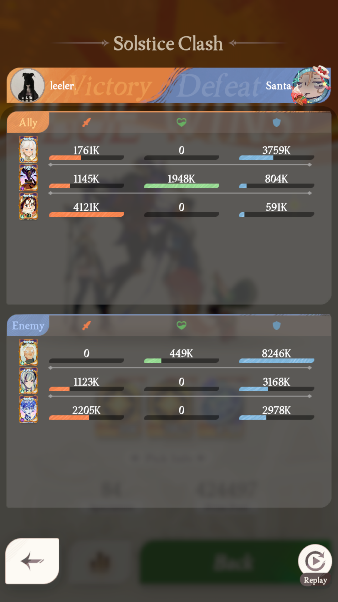
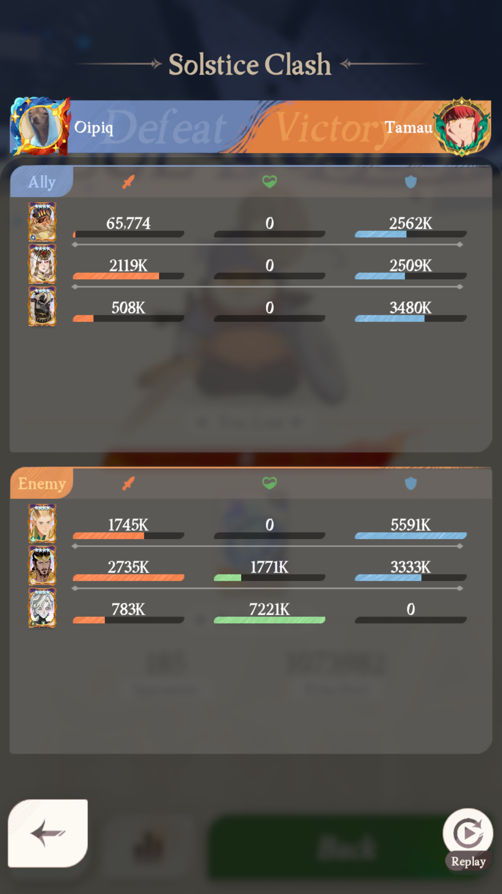

# Converging Paths - match data

Screenshots and their parsed data live together in this folder. One details-screen
screenshot per match, `match-NNN.png`, with the block of the same id below.

Compete and spectate matches are recorded TOGETHER on purpose. The claim under test is that
the details screen is identical in both modes; separating them by folder would hide the
evidence either way. Each block records its `mode` so the two can be compared later.

Blue is the LEFT player. On this screen that is the `Ally` panel in both modes observed so
far.

---

## match-001



```
id: 001
screenshot: match-001.png
mode: compete
date: 2026-07-26 09:45
theme: Converging Paths
blue_player: GameRetro
red_player: Sisif
blue_rating:
red_rating:
blue_rank:
red_rank:
blue_heroes: Solise, Valka, Kafra
red_heroes: Laios, Callan, Silven
winner: red
```

Per-hero stats read from the same screenshot. Columns are named for their ICONS, because the
shield column's meaning is still unconfirmed:

| side | hero | sword | heart | shield |
|---|---|---|---|---|
| blue | Solise | 0 | 1,960K | 4,187K |
| blue | Valka | 1,994K | 0 | 5,799K |
| blue | Kafra | 1,486K | 0 | 6,785K |
| red | Laios | 2,639K | 3,228K | 4,123K |
| red | Callan | 245K | 0 | 4,823K |
| red | Silven | 5,022K | 0 | 253K |

**Parse notes.** All six heroes identified by image match at 0.80-0.91 with margins
0.21-0.42, so this compete screenshot works with the cells measured on a SPECTATE frame -
first direct evidence for the identical-screen claim. The winner and all eighteen stat
numbers parsed automatically.

`blue_player` came back from OCR as `GAME`, not `GameRetro`: the account badge overlaps the
start of the name on this screen. Corrected by hand above. Worth knowing before player names
are used for anything that matters, such as the dedupe key.

Ratings and ranks are blank because the details screen does not show them - they are on the
pre-match screen. Leave them empty rather than guessing.

---

## Deadline

`Converging Paths` rotates on **2026-07-28** (event screen showed "Rotates in 2d 20h" on
2026-07-26). Matches are only comparable within a theme, so anything not collected under this
theme before the rotation cannot be recovered afterwards - it belongs to a different
generating process. Collection needs to be running before then.

---

## match-002



```
id: 002
screenshot: match-002.png
mode: spectate
date: 2026-07-26 10:05
theme: Converging Paths
winning_side: left
winning_player: leeler
winning_heroes: Cassadee, Reinier, Pippa
losing_player: Santa
losing_heroes: Granny Dahnie, Lily May, Cryonaia
```

| side | hero | sword | heart | shield |
|---|---|---|---|---|
| won | Cassadee | 1,761K | 0 | 3,759K |
| won | Reinier | 1,145K | 1,948K | 804K |
| won | Pippa | 4,121K | 0 | 591K |
| lost | Granny Dahnie | 0 | 449K | 8,246K |
| lost | Lily May | 1,123K | 0 | 3,168K |
| lost | Cryonaia | 2,205K | 0 | 2,978K |

**Parse notes.** All six heroes identified at 0.836-0.924.

This screenshot caught a real bug. It is the first frame where the LEFT side won, and the
parser reported the winner as the right side - inverted. Cause: OCR found no "Victory" or
"Defeat" text at all in the header band, only the player names, because those words are
faint watermark-style text. The two earlier frames both happened to have the right side
winning, so a wrong implementation passed them.

Fixed by reading the winner from which header half is tinted orange (the winning half) and
keeping OCR only as a fallback. Verified on all four frames with independently known
winners, two right-wins and one left-win: 4/4 correct, no side favoured.

---

## match-003



```
id: 003
screenshot: match-003.png
mode: spectate
date: 2026-07-26 23:10
theme: Converging Paths
winning_side: right
winning_player: Tamau
winning_heroes: Eironn, Baelran, Ludovic
losing_player: Oipiq
losing_heroes: Hugin, Galahad, Nazrik
```

| side | hero | sword | heart | shield |
|---|---|---|---|---|
| won | Eironn | 1,745K | 0 | 5,591K |
| won | Baelran | 2,735K | 1,771K | 3,333K |
| won | Ludovic | 783K | 7,221K | 0 |
| lost | Hugin | 65,774 | 0 | 2,562K |
| lost | Galahad | 2,119K | 0 | 2,509K |
| lost | Nazrik | 508K | 0 | 3,480K |

**Parse notes.** 6/6 at 0.802-0.910, winner and both player names correct.

This frame settled the letter-matching question. The idea was sound - "Victory" and "Defeat"
share only e and t, so partial text should disambiguate - but across four frames OCR never
recovered "Victory" at all, only "feat" and "Defea". Worse, the one word that does read is
the one a player name can imitate: names sit in the same band, a long name bleeds inward past
any inner-band crop, and real examples cut both ways. Here **Tamau** carries a Defeat letter
while on the WINNING side, and **Oipiq** carries Victory letters while on the LOSING side.

So the winner is read from colour alone, which was correct on all five frames checked in both
directions. A tie returns None rather than a guess.
